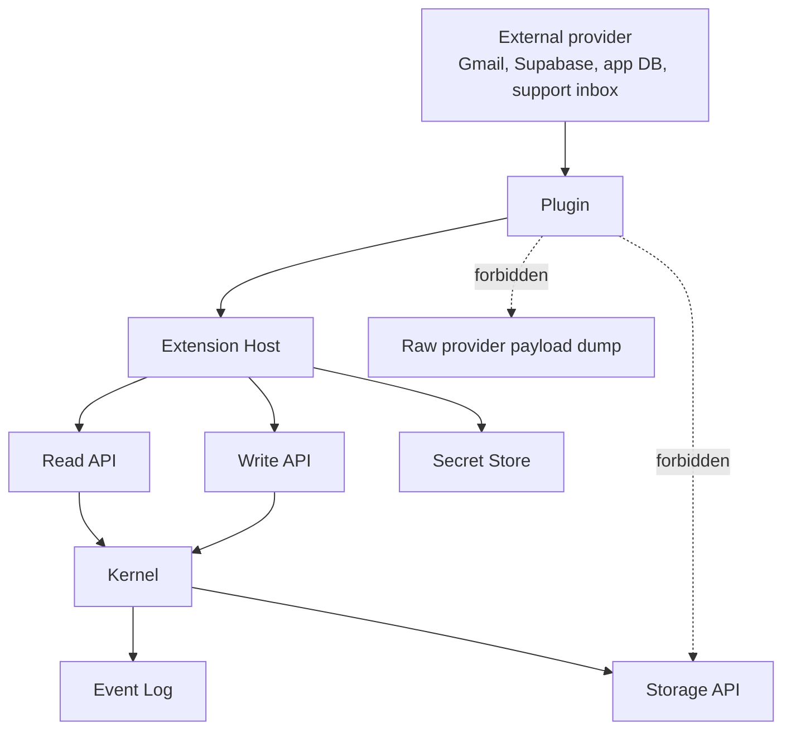

<!-- GENERATED by tools/generate_docs_site.ts. Do not edit by hand. -->

# Plugin Data Safety

Plugins move private customer, prospect, and app-user data across system boundaries. The safety goal
is to keep that movement narrow, explicit, auditable, and reversible without making the kernel own
provider-specific privacy logic.

This document is a required checklist for plugins that read external systems, write CRM records, use
secrets, or process personal information.

## Boundary

The Extension Host is the runtime safety boundary. The kernel remains the durable CRM boundary.

## Hard Requirements

Plugin authors must satisfy these requirements before a plugin is considered safe enough to ship.

### Data Minimization

Copy only the data Bare CRM needs for durable relationship memory.

Allowed examples:

- app user id
- email address needed to identify a person
- display name
- small non-sensitive traits such as plan, status, or lifecycle stage
- provider message id, thread id, or admin URL as `externalRefs`
- short email summary or activity body when intentionally promoted

Avoid by default:

- full Supabase user rows
- raw Gmail messages
- OAuth tokens
- API keys
- auth/session metadata
- billing details
- addresses, phone numbers, or profile blobs unless required for the CRM workflow
- private provider payloads in `custom`

### Workspace Isolation

Every plugin operation must be scoped by `workspaceId`.

Workspace scope applies to:

- plugin installation
- capability grants
- secrets
- sync cursors
- app-user lookup configuration
- provider account/inbox
- `externalRefs`
- CRM reads and writes

App A data must not be readable from App B just because both apps use the same plugin package.

### Explicit Capabilities

Plugins request only the capabilities they need. The host approves capabilities per workspace.

Common examples:

- lookup-only app user plugin: `plugin:commands`, `network:external`, `secrets:read`
- app user linker: lookup capabilities plus `crm:read:record.search`, `crm:write:person.create`, and
  `crm:write:record.update`
- Gmail sync: `plugin:sync`, `network:external`, `secrets:read`, `crm:read:record.search`, and the
  specific CRM write operations it performs

Do not use broad capabilities as a shortcut in production reviews.

### Secrets Stay Out Of CRM

Secrets live in the Extension Host secret store or a production secret manager.

Never store secrets in:

- CRM records
- Event Log payloads
- `custom`
- `externalRefs.url`
- plugin manifests
- logs
- CLI/admin output
- dashboard responses

Examples of secrets:

- Supabase service role keys
- Gmail OAuth refresh tokens
- API keys
- Postgres connection strings
- webhook signing secrets
- access tokens

### No Raw Provider Payloads

Plugins should normalize provider data into CRM primitives instead of dumping raw external payloads
into the kernel.

Preferred mappings:

- email message worth remembering -> `Activity`
- email/support thread worth grouping -> `Collection`
- follow-up -> `Task`
- internal summary -> `Note`
- app user identity -> `Person.externalRefs`
- attachment or derived artifact -> `File`

Provider-specific cursors, raw rows, raw messages, review queues, and ignored sender rules are
plugin-owned state.

### Auditable Writes

Every durable CRM write goes through the Write API via the Extension Host.

Plugin writes must have plugin actor context, so Event Log metadata can answer:

- which plugin wrote this?
- which workspace was affected?
- which operation ran?
- what idempotency key was used?
- which external reference caused the write?

### Idempotency And Dedupe

Provider notifications are often repeated. Plugins must tolerate retries.

Use stable idempotency keys and provider refs:

- Gmail message activity: `gmail:message:{messageId}:activity`
- Gmail thread collection: `gmail:thread:{threadId}:collection`
- app user person link: `supabase-users:person:{system}:{userId}`

Repeated sync, webhook, or lookup runs should not create duplicate people, activities, collections,
or tasks.

### Redacted Operational Surfaces

Admin, CLI, diagnostics, canaries, migration rehearsals, and validation output should return
metadata, counts, status, and error codes by default.

They should not print:

- raw records
- note bodies
- email bodies
- email addresses unless the command is intentionally user-facing and authorized
- provider payloads
- secrets
- connection strings

### Retention And Deletion

Every provider plugin should document what happens when:

- an app user is deleted
- an email thread should not be retained
- a person requests deletion
- a workspace is deleted
- a provider account is disconnected
- a sync cursor is reset

The first implementation may not automate all deletion flows, but the plugin must state where the
data lives and which records/refs it creates.

## Review Checklist

Before merging a plugin, answer these questions in the plugin README or design doc:

- What external systems does this plugin call?
- What secrets does it require?
- What data does it read?
- What data does it write to CRM?
- What raw provider data is deliberately not stored?
- Which capabilities are required and why?
- How is each operation scoped by `workspaceId`?
- Which `externalRefs` are used for dedupe?
- What idempotency keys are used for writes?
- What happens on retry?
- What happens when a provider returns duplicate or ambiguous matches?
- What operational output is redacted?
- What is the retention/deletion story?

## Current Plugin Posture

Bare Gmail:

- stores promoted customer memory as `Collection`, `Activity`, and `Task`
- keeps Gmail OAuth, cursors, raw provider state, ignored sender rules, and review queues outside
  the kernel
- dedupes with Gmail message/thread external refs

Bare Supabase Users:

- treats app users as an external system, not a kernel entity
- stores only app-user links and small safe traits on CRM people
- keeps full Supabase rows, auth metadata, and service role keys outside the kernel
- scopes Supabase config and secrets per workspace

Bare Instagram:

- stores selected social thread memory as `Collection`, `Activity`, and optional `Task`
- keeps OAuth tokens, webhook secrets, watched thread state, seen reply ids, and raw provider
  payloads outside the kernel
- dedupes with Instagram thread/reply external refs

Bare Reddit:

- stores selected social thread memory as `Collection`, `Activity`, and optional `Task`
- keeps OAuth tokens, API credentials, watched thread state, seen reply ids, and raw provider
  payloads outside the kernel
- dedupes with Reddit thread/reply external refs

