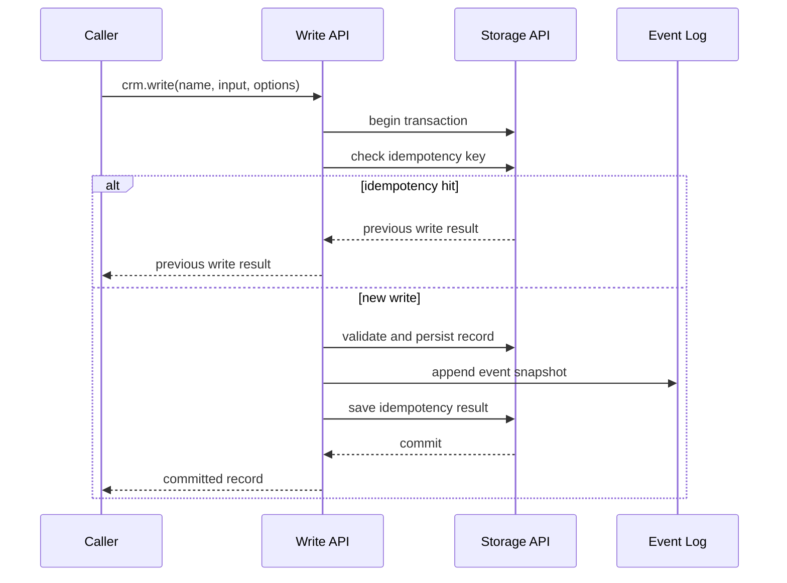
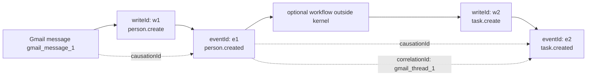

<!-- GENERATED by tools/generate_docs_site.ts. Do not edit by hand. -->

# Event Log

The Event Log records successful Write API operations.

It is durable audit history. It is not a workflow runner, scheduler, queue, or event-sourcing replay
engine.

## Write Lifecycle



An event is appended only after the kernel has produced a valid committed record inside the same
storage transaction. If the transaction rolls back, the event and idempotency result roll back too.

## Event Shape

```ts
type CrmEvent = {
  id: string
  schemaVersion: 1
  workspaceId: string
  name: "person.created" | "company.updated" | "deal.archived" | string
  operation: WriteName
  recordRef: EntityRef
  recordVersion: number
  record: AnyRecord
  occurredAt: string
  writeId: string
  source: "manual" | "import" | "plugin" | "sync" | "agent"
  actorType?: "human" | "plugin" | "agent" | "sync" | "system"
  actorId?: string
  actorDisplayName?: string
  causationId?: string
  correlationId?: string
  idempotencyKey?: string
}
```

The `record` field is the committed record snapshot. Consumers should not assume that reading the
current record later will match the event snapshot.

## IDs And Tracing

- `id`: immutable event ID.
- `writeId`: unique ID for one Write API attempt that committed.
- `idempotencyKey`: caller-provided idempotency key scoped by workspace and write name.
- `causationId`: the event, write, external message, or job that directly caused this write.
- `correlationId`: stable trace ID across a larger flow.
- `actor*`: who or what requested the write.
- `source`: the origin category of the committed record.

Example:



## Read API

Events are listed through:

```ts
await crm.read("event.list", {
  workspaceId: "workspace_1",
  limit: 100,
  name: "person.created",
  record: { type: "person", id: "person_1" },
  actorId: "gmail_sync",
  source: "sync",
  causationId: "gmail_message_1",
  correlationId: "gmail_thread_1",
  idempotencyKey: "gmail:message:1",
})
```

Results are workspace-scoped and returned oldest-to-newest within the latest matching window. A
`limit` of `1` returns the latest matching event.

## Retry Semantics

If a caller provides the same idempotency key for the same workspace and write operation, the kernel
returns the original write result and does not append another event.

Idempotency keys are scoped by:

- workspace
- write operation name
- caller-provided key

That means `person.create` and `company.create` can safely use the same import row key without
colliding.

## Security Guidance

The kernel stores event snapshots because audit history must be durable. Callers that expose events
through MCP, UI, exports, or plugins should filter by workspace and capabilities before returning
events.

Do not place secrets in record fields or event metadata. Optional layers can add redaction before
display or export, but the kernel should treat the Event Log as durable data.

