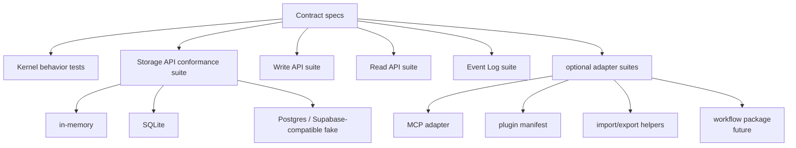

# Conformance Tests

Bare CRM should stay small because its behavior is tested as contracts, not protected by a large
application shell.

Every first-class Storage API implementation and optional adapter should pass the same behavioral
expectations wherever possible.

## Test Architecture



## Current Suites

The current test suite runs with:

```sh
deno fmt
deno task check
deno task test
```

`deno task test` currently runs:

- `tests/kernel.test.ts`
- `tests/storage.test.ts`
- `tests/import_export.test.ts`
- `tests/plugins.test.ts`
- `tests/mcp.test.ts`
- `tests/gmail_plugin.test.ts`

The same kernel and storage scenarios run against:

- in-memory storage
- SQLite storage
- Postgres/Supabase-compatible fake storage

The fake Postgres adapter is intentionally local so the base suite does not require a hosted
service. A live Postgres/Supabase integration suite can be added later behind explicit credentials.

## v0.1 Acceptance Matrix

| Area                   | Required coverage                                              | Current status         |
| ---------------------- | -------------------------------------------------------------- | ---------------------- |
| Entity creation        | every core record type can be created                          | covered                |
| Write API              | create, update, archive, relation create                       | covered                |
| Read API               | get, search, timeline, relation list, event list               | covered                |
| Event Log              | successful writes append audit events                          | covered                |
| Storage API            | get/put/search/events/idempotency/transactions                 | covered                |
| Workspace isolation    | records, relations, reads, events, idempotency                 | covered                |
| Archive behavior       | default reads hide archived records and relations              | covered                |
| Relations              | endpoints must exist and relation reads work from both sides   | covered                |
| Optimistic concurrency | stale versions conflict at storage boundary                    | covered                |
| Idempotency            | write replay and workspace/write-name scoping                  | covered                |
| Permissions            | strict context, actor, read/write capabilities                 | covered                |
| Import/export          | external-ref match/create/update/dry-run/export                | covered                |
| Plugin manifests       | valid examples, forbidden storage access, unknown capabilities | covered                |
| MCP adapter            | tool/resource mapping, structured errors, policy hook          | covered                |
| Gmail plugin           | classifier, dedupe refs, kernel draft mapping                  | covered                |
| Policy package         | allow/warn/block evaluation                                    | planned outside kernel |
| Workflow package       | dispatch, idempotency, loop prevention                         | planned outside kernel |

## Failure Modes

The suite should include failure cases, not only happy paths.

Current failure coverage includes:

- duplicate record IDs
- missing relation endpoints
- workspace mismatch between context and input
- missing strict-mode context
- missing strict-mode actor
- missing read/write capabilities
- stale storage versions
- transaction rollback after failure
- ambiguous external references
- forbidden plugin `storage:*` capabilities
- unknown plugin capabilities
- MCP permission errors with required capability and repair hint
- MCP resource workspace mismatch
- Gmail ignored-message rules and promoted/suggested business signals

Future failure coverage should include:

- policy warn/block outcomes
- workflow idempotency replay
- workflow loop guard behavior
- live Postgres network/connection failures
- malformed MCP server transport requests when an actual server package exists

## Storage Conformance Pattern

New Storage API implementations should run the same storage contract suite:

```ts
runStorageConformanceSuite(() => createMemoryStorage())
runStorageConformanceSuite(() => createSqliteStorage(tempDb()))
runStorageConformanceSuite(() => createPostgresStorage(testDb()))
```

The current tests implement this pattern directly with scenario arrays. If the suite grows, extract
the shared scenario runners before adding another adapter.

## Optional Adapter Pattern

Optional adapters should prove that they do not bypass the kernel:

- MCP tools map to Write API, Read API, or documented optional hooks
- plugin manifests cannot request direct Storage API access
- imports search through the Read API and mutate through the Write API
- future workflows listen to Event Log records and write through the Write API
- future policy packages can block or warn before a Write API operation commits

## CI Expectations

CI should run on pull requests and pushes to `main`:

- `deno fmt --check`
- `deno task check`
- `deno task test`

Base CI must not require external hosted services. Live service tests should be opt-in and clearly
separated from the required conformance suite.

## Non-Goals

- no brittle snapshots of internal implementation details
- no UI tests until a UI exists
- no hosted Postgres/Supabase requirement for the base suite
- no MCP/Noros transport tests before a concrete server package exists
- no policy/workflow runtime tests inside the core kernel package
