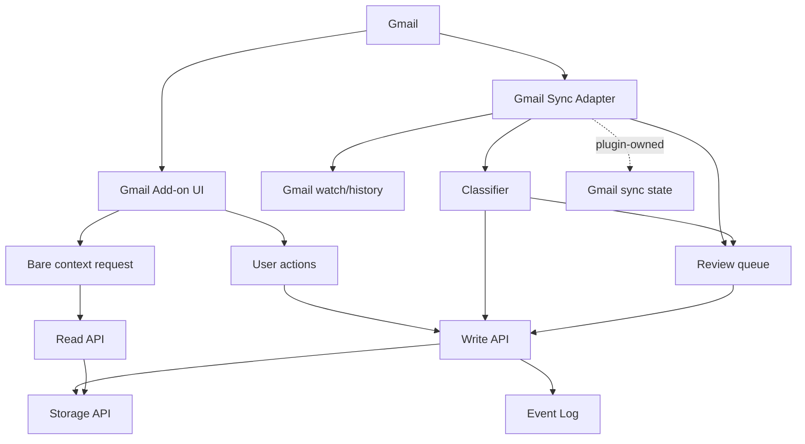

# Bare Gmail Plugin

Bare Gmail is the first channel plugin. It lets people keep working in Gmail while Bare CRM captures
only durable customer memory.

It is one plugin package with two runtime surfaces:

- Gmail Add-on UI for in-message context and small actions
- Gmail sync adapter for OAuth, watch/history sync, filtering, classification, and idempotent writes

The kernel does not gain Gmail-specific entities.

## Why This Is Not A Second Inbox

Gmail remains the communication surface. Bare CRM stores normalized business memory:

- `Activity` for meaningful email interactions
- `Task` for follow-ups implied by messages
- `Note` for durable internal context
- `Relation` for links to people, companies, deals, tasks, files, or activities
- `File` only when attachments or derived artifacts are worth preserving

Raw Gmail concepts such as message id, thread id, history id, sync cursor, body hash, labels,
classification score, ignored sender/domain rules, and review state are plugin-owned data.

## Package Boundary



## Gmail Add-on UI

Google Workspace add-ons can extend Gmail with homepages, contextual interfaces for opened messages,
contextual compose interfaces, and draft actions. The Bare panel should use the contextual message
surface for the current email/thread.

When opened on a message, the panel should answer:

- who is this person or company?
- is there an active deal, task, issue, or recent timeline?
- what does this message appear to change?
- what should happen next?

Small actions:

- attach to deal
- create lead
- create follow-up task
- save activity
- ignore sender
- ignore domain
- mark as not CRM relevant

The add-on should identify the current Gmail message/thread, build a `GmailContextRequest`, and then
use the Read API/MCP adapter to search people, companies, deals, timeline, and policy issues.

## Gmail Sync Adapter

The sync adapter uses Gmail API OAuth and plugin-owned sync state.

Expected flow:

1. Create or refresh a Gmail watch for the mailbox.
2. Receive a mailbox change notification.
3. Use Gmail history from the last stored `historyId` to find changed messages.
4. Fetch message/thread metadata needed for classification.
5. Deduplicate by stable external refs before writing.
6. Classify as ignore, observe-only, suggest, or promote.
7. Write only meaningful memory through the Write API.
8. Store plugin-owned cursor/review state outside the kernel.

The base suite does not implement live OAuth, Pub/Sub, or Gmail transport yet. The first executable
slice is deterministic classification, dedupe refs, context request construction, and kernel draft
mapping.

## Classification Buckets

`classifyGmailMessage` returns:

- `ignore`: no CRM memory and no review item
- `observe_only`: track plugin sync state but do not write CRM memory
- `suggest`: create a review suggestion for user feedback
- `promote`: high-confidence business signal; create/update Bare records

Initial ignore rules:

- known ignored sender
- known ignored domain
- internal-only thread
- newsletter/bulk mail using `List-Unsubscribe` or Gmail category labels
- no-reply/system mail with automated receipt/digest/newsletter subjects

Initial business signals:

- pricing, quote, budget, proposal
- legal, contract, MSA, DPA, terms
- renewal, subscription
- cancellation or churn risk
- timeline, deadline, go-live, launch
- approval or decision
- meeting/demo/call scheduled
- follow-up or next step
- support issue, complaint, blocked state, risk

Known customer/company domains increase confidence. Unknown external senders with one signal go to
`suggest`; known customer domains with signals go to `promote`.

## Review Queue

The first review queue is plugin-owned. It should not be a kernel entity.

Review items should be created for:

- uncertain leads from unknown domains
- possible deal updates without a confident deal match
- support/risk messages that need human routing
- follow-up detection where assignee or due date is unclear

Feedback actions should update plugin-owned settings:

- ignore sender
- ignore domain
- mark not CRM relevant
- confirm lead
- confirm activity
- attach to deal

Confirmed actions write through the Write API.

## Kernel Command Usage

Promoted or confirmed messages map to existing kernel writes:

| Plugin action                 | Kernel operation  |
| ----------------------------- | ----------------- |
| save activity                 | `activity.create` |
| create follow-up              | `task.create`     |
| add context                   | `note.create`     |
| attach to deal/person/company | `relation.create` |
| update customer/deal state    | `record.update`   |
| preserve attachment/artifact  | `file.create`     |

Use `source: "plugin"` and `externalRefs`:

```ts
;[
  { system: "gmail", id: "message:msg_1", kind: "source" },
  { system: "gmail", id: "thread:thread_1", kind: "source" },
]
```

Plugin-owned Gmail detail belongs in `custom.gmail`.

## Dedupe

The stable dedupe key for message writes is:

```txt
gmail:message:{messageId}
```

The thread ref is preserved as related provenance:

```txt
gmail:thread:{threadId}
```

The plugin should call `record.search` with the message external ref before `activity.create`.
Repeated sync runs should be idempotent even if Gmail sends repeated notifications or history
contains previously observed messages.

## Sources

- Google Workspace Gmail add-ons overview: https://developers.google.com/workspace/add-ons/gmail
- Gmail API push notifications: https://developers.google.com/workspace/gmail/api/guides/push
- Gmail API history list:
  https://developers.google.com/workspace/gmail/api/reference/rest/v1/users.history/list
- Gmail API messages resource:
  https://developers.google.com/workspace/gmail/api/reference/rest/v1/users.messages

## Non-Goals

- no Gmail-specific kernel entity
- no full inbox UI
- no raw email firehose in Bare CRM
- no live Gmail OAuth transport in the first helper slice
- no model-required classifier
- no direct Storage API access
