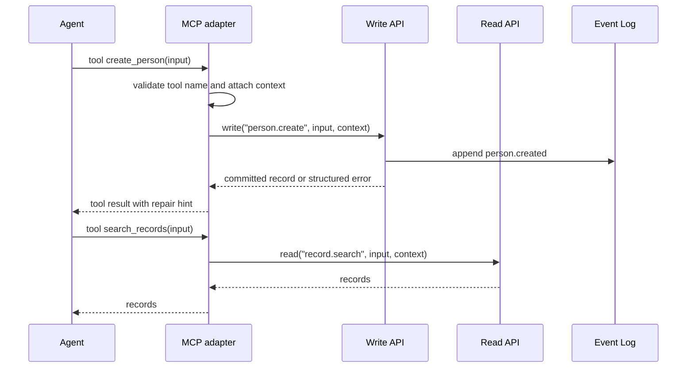

# MCP Adapter

Bare CRM can expose an MCP server, but MCP is optional and outside the core runtime. It is a gateway
over the Write API and Read API.

The adapter contract is intentionally small:

- tools call exactly one Write API operation, one Read API operation, or one documented outside-core
  policy hook
- resources resolve through Read API operations or static schema metadata
- no tool or resource exposes direct Storage API access
- workspace and actor context come from the adapter/session, not model-supplied arguments

## Adapter Flow



## Tool Registry

The executable registry lives in `src/adapters/mcp/mod.ts` as `MCP_TOOL_DEFINITIONS`.

| MCP tool             | Kind   | Kernel operation     | Mutates |
| -------------------- | ------ | -------------------- | ------- |
| `create_person`      | write  | `person.create`      | yes     |
| `create_company`     | write  | `company.create`     | yes     |
| `create_deal`        | write  | `deal.create`        | yes     |
| `create_collection`  | write  | `collection.create`  | yes     |
| `create_activity`    | write  | `activity.create`    | yes     |
| `create_note`        | write  | `note.create`        | yes     |
| `create_task`        | write  | `task.create`        | yes     |
| `update_record`      | write  | `record.update`      | yes     |
| `archive_record`     | write  | `record.archive`     | yes     |
| `link_records`       | write  | `relation.create`    | yes     |
| `search_records`     | read   | `record.search`      | no      |
| `get_record`         | read   | `record.get`         | no      |
| `get_timeline`       | read   | `timeline.list`      | no      |
| `list_relations`     | read   | `relation.list`      | no      |
| `list_events`        | read   | `event.list`         | no      |
| `list_policy_issues` | policy | optional policy hook | no      |

`list_policy_issues` is intentionally not a kernel read operation. Policies are outside the core, so
the adapter accepts an optional policy issue provider. Without one, it returns an empty list.

## Resource Registry

The executable registry lives in `src/adapters/mcp/mod.ts` as `MCP_RESOURCE_TEMPLATES`.

| Resource                               | Behavior                                               |
| -------------------------------------- | ------------------------------------------------------ |
| `crm://record/{type}/{id}`             | calls `read("record.get")` in the context workspace    |
| `crm://timeline/{type}/{id}`           | calls `read("timeline.list")` in the context workspace |
| `crm://search?q={query}`               | calls `read("record.search")` in the context workspace |
| `crm://workspace/{workspaceId}/schema` | returns static adapter schema metadata                 |
| `crm://workspace/{workspaceId}/events` | calls `read("event.list")` after workspace match       |

Workspace-scoped resources must match the authenticated execution context. A model cannot switch
workspaces by changing the URI.

## Permission Context

MCP adapters should construct context from trusted session state:

```ts
const context = createMcpExecutionContext({
  workspaceId: "workspace_1",
  actorId: "agent_1",
  displayName: "Sales assistant",
  capabilities: ["crm:read", "crm:write:person.create"],
  correlationId: "gmail_thread_123",
})
```

The model should provide CRM arguments, not identity, workspace authority, storage credentials, or
capabilities. In strict kernel mode, missing or insufficient capabilities return structured
failures.

## Tool Results and Errors

`callMcpTool` returns a small envelope:

```ts
type McpCallResult<T> =
  | { ok: true; result: T }
  | { ok: false; error: McpErrorShape }
```

Permission failures include the denied operation, required capability, and repair hint:

```json
{
  "ok": false,
  "error": {
    "code": "permission.denied",
    "message": "Write operation requires capability: crm:write:task.create",
    "field": "capabilities",
    "retryable": false,
    "requiredCapability": "crm:write:task.create",
    "tool": "create_task",
    "kind": "write",
    "operation": "task.create",
    "repairHint": "Provide workspaceId, title, and status."
  }
}
```

Policy-layer failures should use the same repair-loop style: stable code, human-readable message,
severity, affected record ref, and optional suggested Write API draft.

## Example Agent Interactions

Search:

```ts
await callMcpTool(
  crm,
  "search_records",
  { workspaceId: "workspace_1", type: "company", text: "acme" },
  { context },
)
```

Create:

```ts
await callMcpTool(
  crm,
  "create_person",
  {
    workspaceId: "workspace_1",
    name: "Ada Lovelace",
    emails: [{ value: "ada@example.com", primary: true }],
    source: "agent",
  },
  { context, idempotencyKey: "agent:create-person:ada@example.com" },
)
```

Create collection:

```ts
await callMcpTool(
  crm,
  "create_collection",
  {
    workspaceId: "workspace_1",
    title: "Acme renewal discussion",
    kind: "sales.renewal",
    related: [{ type: "deal", id: "deal_1" }],
    source: "agent",
  },
  { context, idempotencyKey: "agent:create-collection:acme-renewal" },
)
```

Policy issue:

```ts
await callMcpTool(
  crm,
  "list_policy_issues",
  { workspaceId: "workspace_1", ref: { type: "deal", id: "deal_1" } },
  {
    context,
    listPolicyIssues: () => [{
      code: "deal.company_recommended",
      message: "Deal should be linked to a company before close.",
      severity: "warn",
      ref: { type: "deal", id: "deal_1" },
    }],
  },
)
```

Timeline:

```ts
await callMcpTool(
  crm,
  "get_timeline",
  { workspaceId: "workspace_1", type: "company", id: "company_1", limit: 25 },
  { context },
)
```

## Safety Rules

- All writes call the Write API.
- All reads call the Read API.
- MCP never exposes direct Storage API access.
- Tool descriptions state whether they mutate data.
- `archive_record` is explicitly named and marked destructive.
- Workspace and actor context are attached before kernel calls.
- No secrets or raw storage credentials are exposed through MCP.
- Noros-specific assumptions stay outside the adapter.

## Non-Goals

- no mandatory MCP dependency for using the kernel
- no arbitrary SQL or storage query tool
- no raw Storage API resources
- no embedded agent runtime
- no Noros-specific protocol inside Bare CRM
