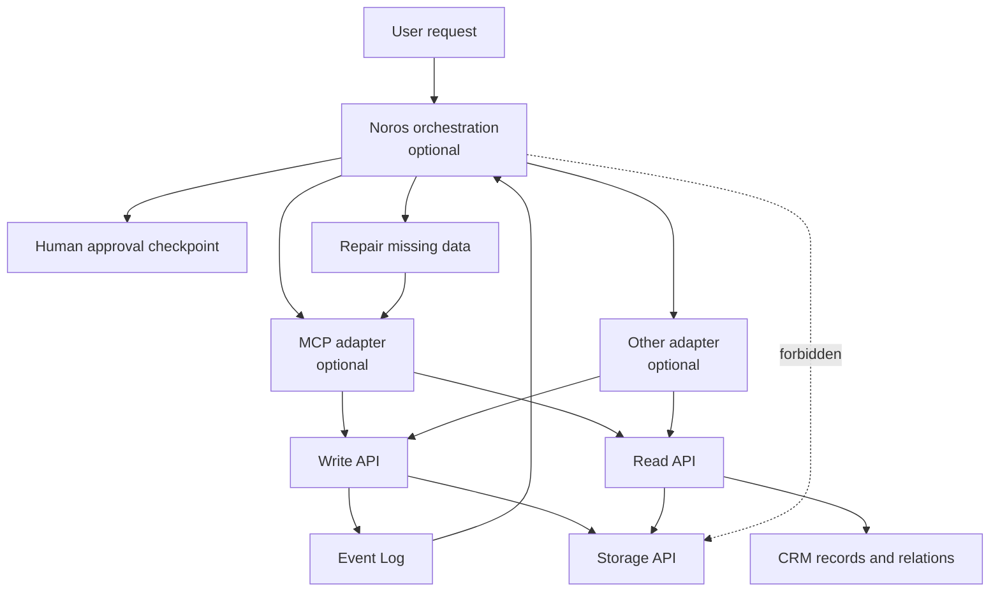
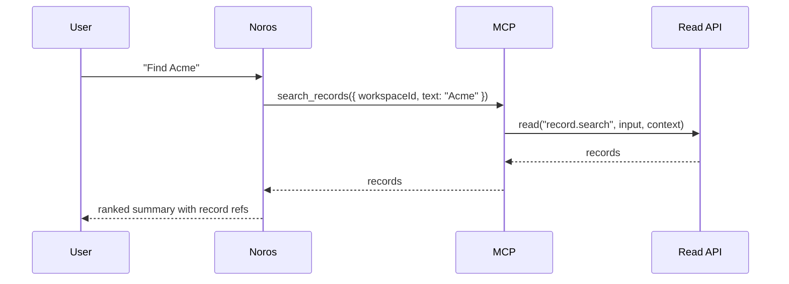
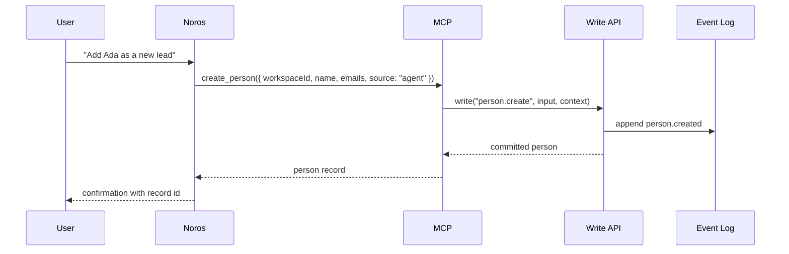
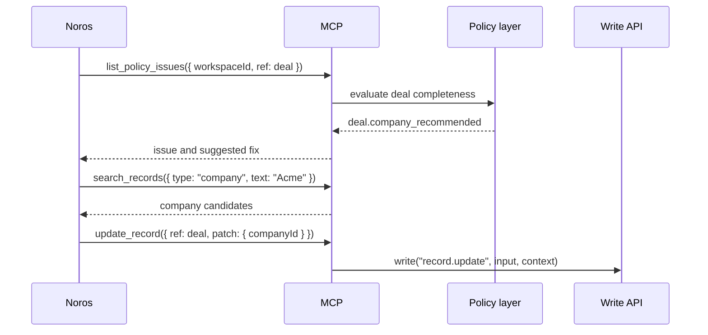
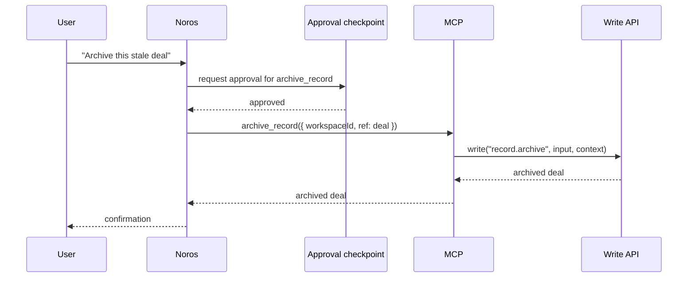

# Noros Integration

Noros is optional orchestration outside the Bare CRM kernel.

Bare CRM must work without Noros. Noros can make Bare CRM more useful for agentic workflows, repair
loops, approvals, and long-running processes, but it does not own durable CRM facts and it does not
change kernel invariants.

## Collaboration Boundary



Noros may call Bare CRM through MCP or through another adapter, but all durable mutations still pass
through the Write API and all durable reads pass through the Read API.

## Ownership

Bare CRM owns:

- CRM records and relations
- Write API, Read API, Event Log, and Storage API
- stable entity identity, versions, timestamps, workspace isolation, and audit history
- structured kernel and permission failures
- optional MCP adapter semantics
- durable facts after a write commits

Noros may own:

- multi-step agent orchestration
- planning which tool to call next
- explaining policy failures to users
- proposing repair writes
- requesting and tracking human approval
- monitoring unresolved completeness issues
- scheduling long-lived business workflows above the kernel
- transient reasoning, prompts, and model-specific state

The key rule: Noros can decide what to attempt, but Bare CRM decides what actually commits.

## Required MCP Surface

The optional MCP adapter already exposes the minimum surface Noros needs.

Write tools:

- `create_person`
- `create_company`
- `create_deal`
- `create_activity`
- `create_note`
- `create_task`
- `update_record`
- `archive_record`
- `link_records`

Read and policy tools:

- `search_records`
- `get_record`
- `get_timeline`
- `list_relations`
- `list_events`
- `list_policy_issues`

Resources:

- `crm://record/{type}/{id}`
- `crm://timeline/{type}/{id}`
- `crm://search?q={query}`
- `crm://workspace/{workspaceId}/schema`
- `crm://workspace/{workspaceId}/events`

Noros should receive a trusted adapter context from the MCP server/session. It should not invent
workspace IDs, actor IDs, capabilities, or storage credentials in model-generated arguments.

## Example Flow: Search



Noros can summarize and rank results, but it should keep record refs visible so follow-up actions
are grounded in durable CRM identity.

## Example Flow: Create



Noros may choose the idempotency key for retried agent actions. The kernel owns idempotent write
replay.

## Example Flow: Repair

Policy and completeness checks are above the kernel. Noros can turn structured issues into a repair
loop.



Repair writes are normal Write API calls. Noros does not patch storage or mutate policy state
directly.

## Example Flow: Approval

Human approval belongs above the kernel. The kernel records only the durable CRM result after an
approved write.



If approval is denied, no CRM write occurs. If approval is granted, the Write API appends the audit
event with the adapter context.

## Event-Driven Monitoring

Noros may watch the Event Log through MCP resources or the Read API:

```ts
await readMcpResource(crm, "crm://workspace/workspace_1/events?limit=100", { context })
```

Useful monitors include:

- new deal without company
- overdue task without assignee
- customer activity without follow-up
- import completed with ambiguous external references
- policy issue unresolved after a configured interval

Monitors can propose writes, create tasks, or ask for approval, but the final durable change still
uses the Write API.

## Non-Goals

- no Noros dependency in the kernel
- no agent prompt logic inside the kernel
- no LLM judgment for kernel invariants
- no Noros-only durable CRM memory
- no direct Storage API access from Noros
- no hidden mutation outside Write API

## Design Rule

Bare CRM is the durable memory. Noros is optional orchestration around that memory.
