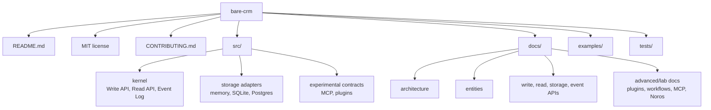

# Open Source Plan

Bare CRM should be public as a tiny CRM kernel, not a full CRM application.

The public repository should make the distinction obvious in the first screen: Bare CRM provides
durable CRM primitives that other apps, agents, plugins, and tools can build on.

## Repository Shape

The repository starts as one small Deno package. A package split should wait until the API is stable
enough to justify publishing multiple artifacts.

Stable package direction:

- `@bare-crm/kernel`
- `@bare-crm/sqlite`
- `@bare-crm/postgres`
- `@bare-crm/cli`

Experimental packages should wait until the kernel API is settled:

- `@bare-crm/mcp`
- `@bare-crm/plugin-sdk`
- `@bare-crm/workflows`
- app plugins
- dashboards and frontend workbenches

## README Outline

The README should explain:

- why Bare CRM exists
- that it is a tiny CRM kernel, not a full CRM app
- the Pi-inspired philosophy: small runtime, explicit primitives, extensible packages
- the four core primitives: Write API, Read API, Event Log, Storage API
- the core entity set: person, company, deal, collection, activity, note, task, file, relation
- SQLite and Postgres/Supabase as first-class storage implementations
- MCP-native but not MCP-dependent
- Noros-compatible but not Noros-dependent
- no required UI
- no embedded model or workflow runner in the core
- dashboards and workflow marketplaces are labs/examples, not the public center of gravity
- how it differs from Twenty, Corteza, Directus, EspoCRM, and SuiteCRM

## License Decision

Bare CRM uses MIT.

Reasoning:

- it is simple and familiar to open-source users
- it makes embedding easy for apps, agents, plugins, and commercial products
- it avoids licensing complexity while the core API is still early

## Initial Docs

Current first-pass documentation:

- `docs/architecture.md`
- `docs/entities.md`
- `docs/write-api.md`
- `docs/read-api.md`
- `docs/event-log.md`
- `docs/storage-api.md`
- `docs/sqlite.md`
- `docs/postgres-supabase.md`
- `docs/publishing.md`
- `docs/policies-workflows.md`
- `docs/plugins.md`
- `docs/plugin-development.md`
- `docs/plugin-data-safety.md`
- `docs/mcp.md`
- `docs/noros.md`
- `docs/import-export.md`
- `docs/permissions.md`
- `docs/conformance.md`
- `docs/channel-strategy.md`
- `docs/app-user-lookup.md`

The original planning split had separate policies and workflows docs. The current repo combines them
in `docs/policies-workflows.md` because both are optional layers above the kernel and share the same
boundary rules.

## Contribution Posture

Contributions should emphasize:

- small core
- explicit contracts
- storage conformance
- tests over promises
- no direct storage access from plugins, agents, MCP, workflows, or imports
- no hardcoded CRM bloat
- no hidden agent runtime inside the kernel

When in doubt, the default answer is: put the behavior in an optional layer and keep the kernel
boring.

## Non-Goals

- no production-ready claim yet
- no package publishing before API review
- no website before README and examples are strong
- no community process heavier than the project needs
- no CRM product roadmap inside the kernel repository
