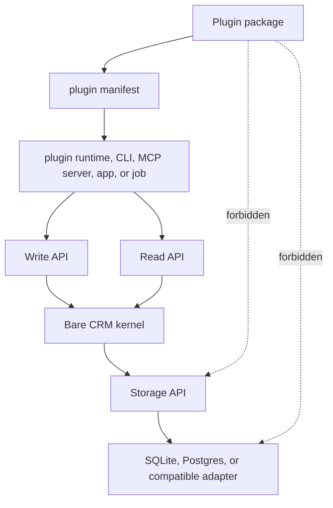

# Plugin Development

This guide is for people building optional packages around the Bare CRM kernel.

The short version:

- declare the plugin with a manifest
- request the smallest useful capabilities
- read through the Read API
- mutate through the Write API
- keep plugin state outside kernel tables
- test the plugin as its own package

The plugin contract is intentionally small. A plugin can add behavior around the CRM, but it cannot
patch the kernel or bypass its boundaries.

## Boundary



Plugins never access the Storage API or database directly. That is `HR-001` in
[Hard rules](hard-rules.md).

## What A Plugin Owns

A plugin may own:

- provider authentication and token refresh
- external sync cursors
- provider-specific cache tables
- local review queues
- classifier prompts and model settings
- command handlers
- UI slots
- plugin-specific tests

Those things live outside the kernel database shape. If a plugin needs its own durable state, it can
use its own database, schema, files, or service, but it still calls the CRM through the Read API and
Write API.

## What The Kernel Owns

The kernel owns:

- CRM records and relations
- entity IDs and versions
- workspace scoping
- writes and validation
- Event Log entries for successful writes
- Storage API adapter behavior
- database schema helpers and migrations

Plugins can request changes to CRM state, but the kernel remains the source of truth for CRM data.

## Suggested Package Shape

A plugin package can use any runtime, but this shape keeps things easy to review:

```text
my-crm-plugin/
  plugin.json
  README.md
  src/
    manifest.ts
    read.ts
    write.ts
    sync.ts
    commands.ts
  tests/
    manifest.test.ts
    sync.test.ts
    writes.test.ts
```

`plugin.json` is the portable declaration. Source files are runtime-specific implementation. Tests
belong with the plugin package, not the kernel conformance suite.

## Manifest

Every plugin starts with a manifest:

```json
{
  "id": "com.acme.gmail",
  "name": "Acme Gmail",
  "version": "0.1.0",
  "description": "Creates CRM tasks and notes from selected Gmail messages.",
  "capabilities": [
    "crm:read:record.search",
    "crm:write:task.create",
    "crm:write:note.create",
    "plugin:sync",
    "network:external",
    "secrets:read"
  ],
  "contributes": {
    "syncs": [
      {
        "id": "gmail-inbox",
        "system": "gmail",
        "label": "Gmail inbox sync",
        "requires": ["network:external", "secrets:read"]
      }
    ]
  }
}
```

Validate manifests with `validatePluginManifest`. The validator rejects unknown capabilities and any
capability beginning with `storage:`.

## Capabilities

CRM capabilities describe what the plugin can ask the kernel to do:

- `crm:read:*`
- `crm:read:record.get`
- `crm:read:record.search`
- `crm:write:*`
- `crm:write:person.create`
- `crm:write:company.create`
- `crm:write:deal.create`
- `crm:write:task.create`
- `crm:write:note.create`
- `crm:write:record.update`
- `crm:write:relation.upsert`
- `crm:write:record.delete`

Runtime capabilities describe what the plugin runtime may need outside the kernel:

- `plugin:fields`
- `plugin:policies`
- `plugin:workflows`
- `plugin:commands`
- `plugin:ui`
- `plugin:sync`
- `network:external`
- `secrets:read`
- `files:read`
- `files:write`

`createPluginExecutionContext` keeps only CRM capabilities when building a kernel context. Runtime
capabilities remain outside the kernel.

## Contributions

Plugin contributions are declarations. They describe what the plugin can add, but they do not run
inside the kernel.

Supported contribution families:

- `fields`: additional typed fields a host app can render or persist through normal record writes
- `policies`: optional package-level rules enforced by a host/runtime before calling the Write API
- `workflows`: optional automations run by a plugin runtime, not by the kernel
- `commands`: explicit plugin actions a host/runtime can expose
- `uiSlots`: optional UI surfaces for apps that have a UI
- `syncs`: external system sync declarations

The kernel can know that these contributions exist without becoming a plugin runner.

## Reading CRM Data

Plugins should use the Read API for all CRM reads. A plugin should ask for the smallest query it
needs, and it should treat missing data as normal because another client may have changed the CRM
state.

Good patterns:

- search before creating records from an import or sync
- read by ID before updating records
- store external IDs in normal CRM fields or plugin-owned state so syncs can be idempotent
- include the plugin actor in the execution context

## Writing CRM Data

Plugins should use the Write API for all durable CRM changes. Write commands are the only supported
mutation path.

Good patterns:

- create small commands instead of writing large batches blindly
- make external sync writes idempotent
- preserve provider IDs in plugin-owned state or explicit record fields
- attach useful source metadata when the Write API supports it
- expect validation errors and surface them to the plugin user

Do not create kernel tables, patch kernel records directly, or mutate adapter internals.

## Plugin State

Some plugins need their own state. For example, a Gmail plugin may need OAuth tokens, last-seen
message IDs, dedupe decisions, and rejected suggestions.

That state is not kernel state. Keep it in one of these places:

- a plugin-owned table or schema in the host app database
- a separate plugin database
- encrypted files
- an external service
- the host runtime's secret store

The official kernel database shape is created only through the supported schema helpers and
migrations documented in [Storage API](storage-api.md), [SQLite](sqlite.md), and
[Postgres and Supabase](postgres-supabase.md).

## Testing A Plugin

Plugin tests should live with the plugin package. They are separate from kernel conformance tests.

Recommended plugin tests:

- manifest validation accepts the published `plugin.json`
- manifest validation rejects accidental `storage:*` capabilities
- command handlers call only the Read API and Write API
- sync handlers are idempotent for repeated provider events
- write commands include the expected actor and workspace context
- provider errors do not partially mutate CRM state
- plugin-owned state migrations are reversible or forward-safe
- fixtures cover duplicate people, duplicate companies, deleted records, and permission failures

Kernel conformance tests prove that every official storage adapter obeys the same Storage API
contract. Plugin tests prove that one plugin behaves correctly through the public CRM interfaces.

## First Plugin Checklist

- Pick a stable lowercase plugin ID.
- Write `plugin.json`.
- Request only the capabilities the plugin needs.
- Add a manifest validation test.
- Implement reads through the Read API.
- Implement writes through the Write API.
- Keep provider state outside kernel tables.
- Add idempotency tests for syncs and imports.
- Document any required secrets, files, or network access.
- Confirm the plugin never requests or uses `storage:*`.
