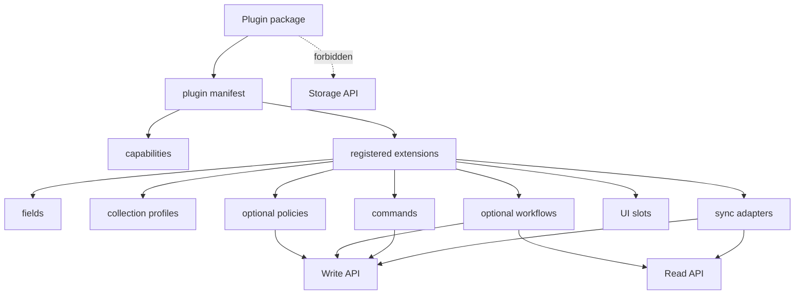

# Plugins

Plugins are optional packages outside the core kernel.

For a practical authoring walkthrough, see [Plugin Development](plugin-development.md). For the
production runtime boundary, see [Extension Host](extension-host.md).

They can contribute:

- fields
- collection profiles
- policies
- workflows
- sync adapters
- UI slots
- extra commands

Plugins use the Write API and Read API. They never write directly to the Storage API.

## Boundary



Plugins may extend behavior, but they do not own kernel invariants and they cannot monkey-patch the
kernel.

UI contributions are declarative metadata. A plugin can declare workbench surfaces such as
`workspace.nav`, `workspace.route`, `record.header`, `record.sidebar`, `command.palette`,
`command.composer`, and `agent.responseCard`, but the kernel never loads or executes frontend code.
Workbench hosts render approved first-party components from their own registries.

In production, a plugin should be loaded by an Extension Host. The host is responsible for
workspace-scoped installation, capability grants, lifecycle hooks, schema/profile contributions,
event subscriptions, sync state, secret access, and optional sandboxing.

## Manifest

```ts
type PluginManifest = {
  id: string
  name: string
  version: string
  description?: string
  capabilities: PluginRuntimeCapability[]
  contributes: PluginContributions
}
```

IDs use lowercase stable segments, for example:

- `example.follow-ups`
- `example.csv-import`
- `com.acme.gmail`

Versions are semver-like, for example `0.1.0`.

## Capabilities

Plugin capabilities include kernel capabilities and optional runtime capabilities:

```ts
type PluginRuntimeCapability =
  | Capability
  | "plugin:fields"
  | "plugin:policies"
  | "plugin:workflows"
  | "plugin:commands"
  | "plugin:ui"
  | "plugin:sync"
  | "plugin:profiles"
  | "network:external"
  | "secrets:read"
  | "files:read"
  | "files:write"
```

Direct Storage API capability is forbidden. The validator rejects `storage:*`.

For the stable public surface, keep plugin manifests small. `plugin:commands` is the first stable
metadata capability. Fields, policies, workflows, UI slots, syncs, and profiles are experimental
until the kernel API settles.

## Contributions

```ts
type PluginContributions = {
  fields?: PluginFieldContribution[]
  collectionProfiles?: PluginCollectionProfileContribution[]
  policies?: PluginPolicyContribution[]
  workflows?: PluginWorkflowContribution[]
  commands?: PluginCommandContribution[]
  uiSlots?: PluginUiSlotContribution[]
  syncs?: PluginSyncContribution[]
}
```

Contribution entries are declarations. They do not execute inside the kernel. Optional plugin
runtimes, CLIs, MCP servers, or apps can load manifests, request capabilities, and then call the
Read API and Write API.

The stable contribution family is `commands`. Other contribution families are available for
experimentation but should not be treated as a long-term public contract yet.

The recommended production runtime is an Extension Host. It may execute plugin hooks or route plugin
commands, but durable CRM reads and writes still go through the kernel APIs.

## Execution Context

`createPluginExecutionContext(manifest, { workspaceId })` creates a strict-mode context for plugin
API calls. Only `crm:*`, `crm:read*`, and `crm:write*` capabilities are passed into the kernel
context; runtime capabilities such as `files:read` stay outside the kernel.

## Examples

The repo includes two example manifests:

- `examples/plugins/follow-up-reminders.json`
- `examples/plugins/csv-import-helper.json`

They are covered by tests so the documented shape stays executable.

## Non-Goals

- no plugin execution inside the core kernel
- no marketplace
- no sandboxing untrusted third-party code yet
- no direct Storage API access
- no plugin-owned kernel invariants
