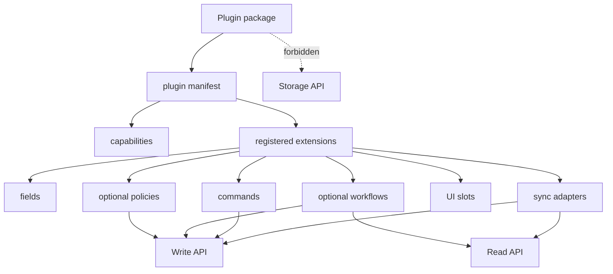

# Plugins

Plugins are optional packages outside the core kernel.

For a practical authoring walkthrough, see [Plugin Development](plugin-development.md).

They can contribute:

- fields
- policies
- workflows
- sync adapters
- UI slots
- extra commands

Plugins use the Write API and Read API. They never write directly to the Storage API.

## Boundary



Plugins may extend behavior, but they do not own kernel invariants and they cannot monkey-patch the
kernel.

## Manifest

```ts
type PluginManifest = {
  id: string
  name: string
  version: string
  description?: string
  capabilities: PluginRuntimeCapability[]
  contributes: PluginContributions
}
```

IDs use lowercase stable segments, for example:

- `example.follow-ups`
- `example.csv-import`
- `com.acme.gmail`

Versions are semver-like, for example `0.1.0`.

## Capabilities

Plugin capabilities include kernel capabilities and optional runtime capabilities:

```ts
type PluginRuntimeCapability =
  | Capability
  | "plugin:fields"
  | "plugin:policies"
  | "plugin:workflows"
  | "plugin:commands"
  | "plugin:ui"
  | "plugin:sync"
  | "network:external"
  | "secrets:read"
  | "files:read"
  | "files:write"
```

Direct Storage API capability is forbidden. The validator rejects `storage:*`.

## Contributions

```ts
type PluginContributions = {
  fields?: PluginFieldContribution[]
  policies?: PluginPolicyContribution[]
  workflows?: PluginWorkflowContribution[]
  commands?: PluginCommandContribution[]
  uiSlots?: PluginUiSlotContribution[]
  syncs?: PluginSyncContribution[]
}
```

Contribution entries are declarations. They do not execute inside the kernel. Optional plugin
runtimes, CLIs, MCP servers, or apps can load manifests, request capabilities, and then call the
Read API and Write API.

## Execution Context

`createPluginExecutionContext(manifest, { workspaceId })` creates a strict-mode context for plugin
API calls. Only `crm:*`, `crm:read*`, and `crm:write*` capabilities are passed into the kernel
context; runtime capabilities such as `files:read` stay outside the kernel.

## Examples

The repo includes two example manifests:

- `examples/plugins/follow-up-reminders.json`
- `examples/plugins/csv-import-helper.json`

They are covered by tests so the documented shape stays executable.

## Non-Goals

- no plugin execution inside the core kernel
- no marketplace
- no sandboxing untrusted third-party code yet
- no direct Storage API access
- no plugin-owned kernel invariants
