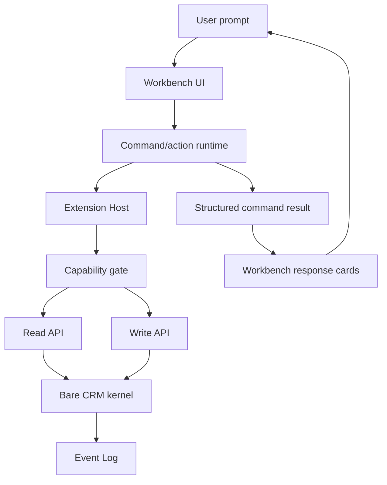

# Plugin-Enabled Workbench UI

The workbench UI is an optional host layer for Bare CRM. It is the place where a Lightfield-style,
chat-first CRM experience can live without making the kernel a product UI, workflow engine, model
runtime, or browser application.

Bare CRM still centers on the small kernel:

- Write API for durable mutations.
- Read API for stable CRM queries.
- Event Log for committed history.
- Storage API for persistence implementations.

The workbench composes those primitives with the Extension Host and trusted first-party plugins.

## Product Model

The v1 workbench is a CRM workspace with a command/chat center:

- a persistent left rail for workspace navigation, records, resources, lists, and chats
- a central transcript where user requests, tool runs, summaries, and plugin cards appear
- a command composer that discovers approved plugin commands
- record-aware side panels and headers for context
- structured response cards for reviewable business actions

The reference interaction is:

> write emails to stalled deals

The workbench routes that request to an approved plugin command, shows progress, renders a
structured review card, and waits for explicit user approval before any external action.

## Runtime Boundary

| Layer           | Owns                                                                                          |
| --------------- | --------------------------------------------------------------------------------------------- |
| Kernel          | CRM records, relationships, events, validation, workspace scoping, storage boundary           |
| Extension Host  | plugin install state, enablement, approved capabilities, secrets, contribution listing        |
| Command Runtime | command routing, run status, safe result shapes, approval action routing                      |
| Workbench UI    | layout, routes, rendering, local interaction state, visual composition                        |
| Plugin          | provider logic, command handlers, sync state, plugin-specific result data and UI declarations |

Plugins never write directly to Storage API implementations. Workbench features that change CRM
facts call plugin commands or extension-host helpers that ultimately use the Read API and Write API.

## V1 UI Contributions

Plugins declare UI surfaces through manifest metadata. The v1 surface names are:

- `workspace.nav`
- `workspace.route`
- `record.header`
- `record.sidebar`
- `command.palette`
- `command.composer`
- `agent.responseCard`

The contributions are declarative. They say what a trusted host may render; they do not execute
frontend code inside the kernel.

For v1, the workbench renders only trusted first-party components from a local registry keyed by
`pluginId + contributionId`. Dynamic third-party React/module loading, iframes, marketplace
delivery, and remote plugin UI execution are post-v1 concerns.

## Command And Card Flow

A command result is a safe, structured shape that the workbench can render into transcript messages
and action cards. It should include:

- run identity and status
- short summary text
- safe messages
- cards with typed rows and actions
- created CRM refs, when a command writes through the kernel
- safe errors that do not include secrets or raw provider payloads

External actions such as sending email are not automatic in v1. The workbench can show review,
dismiss, and approval actions, but provider-side mutation requires explicit user approval and a
separate command/action path.

## Build Sequence

1. Document this boundary and UX contract.
2. Build the workbench shell prototype in the frontend lab.
3. Extend manifest and extension-host UI contribution metadata.
4. Add the trusted first-party plugin UI registry and renderer.
5. Add the command/action runtime contract.
6. Build the stalled-deal follow-up reference plugin.
7. Add deterministic demo data and visual QA coverage.

This order keeps the kernel small while proving the full product loop through optional layers.

## Non-Goals

- no required UI in the core package
- no React, Refine, Vite, browser, or model dependency in the kernel
- no arbitrary third-party executable UI loading in v1
- no direct plugin access to Storage API implementations
- no provider-side sending or external mutation without explicit user approval
- no raw email or provider firehose storage in kernel records
